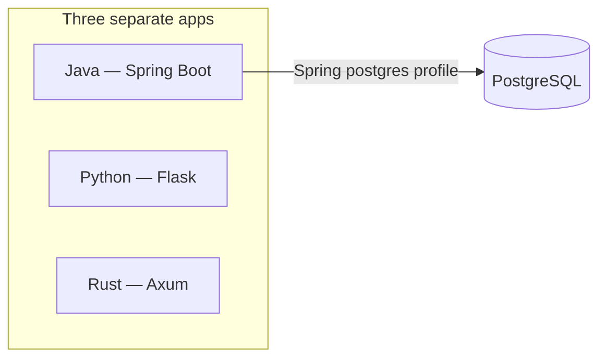
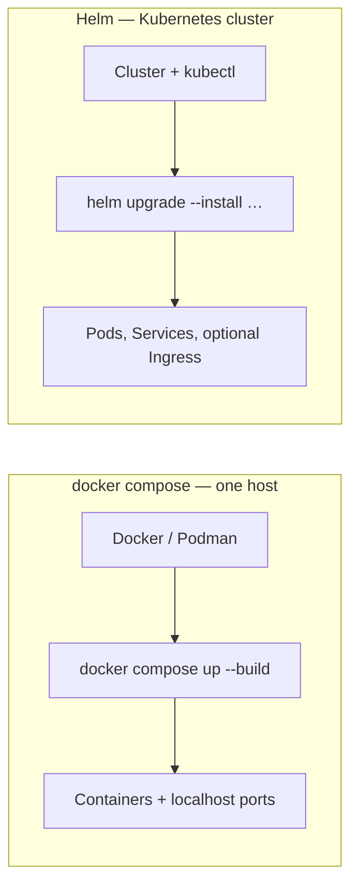

# exercises

Exercises (tiagoyamashita.com)

## Application servers

This repo ships **three separate web apps** under **`apps/`**, plus **Postgres**, **Redis**, **Kafka**, **React Node**, and optional **observability** under **`devops/`**:

| Stack | Folder | Role | Typical URL (local) |
|-------|--------|------|---------------------|
| **Java** | `apps/java/` | Spring Boot | `http://127.0.0.1:8080/` |
| **Python** | `apps/python/` | Flask dashboard | `http://127.0.0.1:5000/` |
| **Rust** | `apps/rust/` | Axum dashboard | `http://127.0.0.1:8082/` |
| **React Node** | `apps/react-node/` | Stack probe UI (React + Express) | `http://127.0.0.1:5174/` |
| **PostgreSQL** | `apps/postgres/` | Shared database (Compose scripts + log dir) | `127.0.0.1:5432` |
| **Redis** | `apps/redis/` | Cache / session store (AOF persistence) | `127.0.0.1:6379` |
| **RedisInsight** | `apps/redis/` | Official Redis GUI (`redis/redisinsight`) | `http://127.0.0.1:5540/` |
| **RedisInsight (embed)** | `apps/redis/embed-proxy/` | nginx proxy for iframe embed | `http://127.0.0.1:5541/` |
| **Kafka** | `apps/kafka/` | Message broker (KRaft, single node) | `127.0.0.1:9092` |
| **Kafka UI** | `apps/kafka/` | Web UI for topics / messages (`provectuslabs/kafka-ui`) | `http://127.0.0.1:8090/` |
| **Kafka UI (embed)** | `apps/kafka/embed-proxy/` | nginx proxy for iframe embed in dashboards | `http://127.0.0.1:8091/` |

**Rust on Windows:** If **`cargo`** fails with **`link.exe` not found**, the MSVC linker is missing — use **`podman compose up --build rust`** from this repo root, or fix the toolchain per [apps/rust/README.md — Troubleshooting](apps/rust/README.md#troubleshooting-rust-server-wont-build-or-wont-open).

Illustration (same stacks; Postgres is used when the Java app is wired to a real database):



They are independent exercises; you can build, run, and deploy **any subset**. **PostgreSQL** is used when you wire the Java app to a real database (for example via Compose or Kubernetes); see **`apps/postgres/`** and [DOCKER.md](DOCKER.md).

_Diagrams use [Mermaid](https://mermaid.js.org/); they render on GitHub. In other viewers you may see the source block only._

## Compose stacks (apps, devops, dev)

From the **repo root**, Compose is split so you can run **apps** and **observability (devops)** separately, and optionally add a **dev** overlay for hot reload on the app services.

### Compose files

| File | Starts | Typical command |
|------|--------|-----------------|
| **`docker-compose.yml`** | Apps **+** devops (full stack) | `podman compose up -d --build` |
| **`docker-compose.apps.yml`** | Postgres, Redis, Kafka, Java, Python, Rust, react-node | `podman compose -f docker-compose.apps.yml up -d --build` |
| **`docker-compose.observability.yml`** | Prometheus, Grafana, ELK, Filebeat | `podman compose -f docker-compose.observability.yml up -d` |
| **`docker-compose.dev.yml`** | Overlay on **apps** only (hot reload) | Add `-f docker-compose.dev.yml` to an **apps** command (see below) |

**Dev overlay** (pair with **`docker-compose.apps.yml`** or full **`docker-compose.yml`**):

```bash
# Apps with hot reload (Java spring-boot:run, Python FLASK_DEBUG, Rust cargo-watch, react-node Vite)
podman compose -f docker-compose.apps.yml -f docker-compose.dev.yml up -d --build

# Full stack: dev apps + production observability images
podman compose -f docker-compose.yml -f docker-compose.dev.yml up -d --build
```

Use **Docker Engine** the same way with `docker compose` instead of `podman compose`. Details: [DOCKER.md](DOCKER.md).

### All services

| Service | Folder | Role | Host port | Compose file | With **`docker-compose.dev.yml`** |
|---------|--------|------|-----------|--------------|-----------------------------------|
| **postgres** | `apps/postgres/` | PostgreSQL 16 | **5432** | apps | Same image (no dev overlay) |
| **redis** | `apps/redis/` | Redis 7 (Alpine, AOF) | **6379** | apps | Same image (no dev overlay) |
| **redisinsight** | `apps/redis/` | RedisInsight GUI (pre-connected to `redis`) | **5540** | apps | Waits for healthy `redis` |
| **redisinsight-embed** | `apps/redis/embed-proxy/` | RedisInsight via nginx (iframe-safe) | **5541** | apps | Proxies `redisinsight` |
| **kafka** | `apps/kafka/` | Apache Kafka 3.9 (KRaft) | **9092** | apps | JSON logs → ELK; **kafka-exporter** → Prometheus |
| **kafka-ui** | `apps/kafka/` | UI for Apache Kafka | **8090** | apps | Waits for healthy `kafka` |
| **kafka-ui-embed** | `apps/kafka/embed-proxy/` | Kafka UI via nginx (iframe-safe) | **8091** | apps | Proxies `kafka-ui` |
| **kafka-exporter** | `apps/kafka/` | Kafka metrics for Prometheus | *(internal)* | apps | Scraped as **`exercises-kafka`** |
| **java** | `apps/java/` | Spring Boot API + UI | **8080** | apps | `spring-boot:run`, source mounted |
| **python** | `apps/python/` | Flask dashboard + `/api/items` | **5000** | apps | `FLASK_DEBUG=1` reloader |
| **rust** | `apps/rust/` | Axum dashboard + `/api/items` | **8082** | apps | `cargo-watch` rebuild on change |
| **react-node** | `apps/react-node/` | Stack probes + items proxy | **5174** | apps | Express + Vite dev server |
| **prometheus** | `devops/prometheus/` | Metrics TSDB + UI | **9090** | observability | — |
| **grafana** | `devops/grafana/` | Dashboards (provisioned) | **3000** | observability | — |
| **elasticsearch** | `devops/elk/` | Log / search store | **9200** | observability | — |
| **logstash** | `devops/elk/` | Beats → Elasticsearch | **5044** | observability | — |
| **kibana** | `devops/elk/` | Log UI | **5601** | observability | — |
| **filebeat** | `devops/elk/` | Tails app, Postgres, and Kafka JSON logs | *(internal)* | observability | — |

**apps** = `docker-compose.apps.yml` · **observability** = `docker-compose.observability.yml`. Restart apps without touching Grafana / ELK: `podman compose -f docker-compose.apps.yml restart java rust`.

### App and Postgres logs in Kibana

**Filebeat** tails JSON log files from Java, Python, Rust, **React Node**, Postgres, and **Kafka**, then ships them through **Logstash** into **Elasticsearch** for **Kibana**.

| Service | Host log file | Kibana filter (`service`) |
|---------|---------------|---------------------------|
| Java | `apps/java/logs/demo-app.json.log` | `exercises-java` |
| Python | `apps/python/logs/demo-app.json.log` | `exercises-python` |
| Rust | `apps/rust/logs/demo-app.json.log` | `exercises-rust` |
| React Node | `apps/react-node/logs/demo-app.json.log` | `exercises-react-node` |
| Postgres | `apps/postgres/logs/postgresql-*` | `exercises-postgres` |
| Kafka | `apps/kafka/logs/kafka*.json.log` | `exercises-kafka` |

**1. Start both stacks** (same Compose project / `exercises` network):

```bash
podman compose -f docker-compose.observability.yml up -d
podman compose -f docker-compose.apps.yml up -d --build
```

After changing Filebeat config, restart it: `podman compose -f docker-compose.observability.yml restart filebeat`.

**2. Generate log lines:**

```bash
curl -s http://127.0.0.1:8080/api/observability/sample-log
curl -s http://127.0.0.1:5000/api/observability/sample-log
curl -s http://127.0.0.1:8082/api/observability/sample-log
curl -s http://127.0.0.1:5174/api/observability/sample-log
```

For Postgres, run DB activity (Java **Create user**, `/api/items`, `psql`, etc.).

**3. Confirm log files on the host:**

```powershell
dir apps\java\logs, apps\react-node\logs, apps\postgres\logs
```

Postgres writes `postgresql-YYYY-MM-DD` (and sometimes `.json` suffix). React Node writes `demo-app.json.log` when `EXERCISES_OBSERVABILITY=1` (set in Compose).

**4. Open Kibana** at **http://127.0.0.1:5601** → **Discover**. Data view: **`logstash-*`**, timestamp: **`@timestamp`**.

**5. Filter in Discover:**

```
service: "exercises-postgres"
service: "exercises-react-node"
```

Or by source path: `log.file.path: *postgresql*` · `log.file.path: *react-node*`

**Quick checks**

| Check | Command |
|-------|---------|
| Indices exist | `curl -s http://127.0.0.1:9200/_cat/indices?v` (look for `logstash-YYYY.MM.dd`) |
| Filebeat healthy | `podman compose -f docker-compose.observability.yml logs filebeat --tail 30` |
| Paths inside Filebeat | `podman compose -f docker-compose.observability.yml exec filebeat ls -la /var/log/postgresql /var/log/react-node` |

Config: **`devops/elk/filebeat/filebeat-compose.yml`**; volume mounts in **`docker-compose.observability.yml`**; app env in **`docker-compose.apps.yml`**. More: [devops/elk/README.md](devops/elk/README.md), [apps/postgres/README.md](apps/postgres/README.md#observability-elk--filebeat).

## How to run or deploy them

**Normal / à la carte:** Run stacks locally the way each folder documents (toolchains, tests, dev servers), or build **container images** and run **one, two, or all** with **Podman** or **Docker**. From the repo root:

```bash
podman compose up -d --build
```

If you use Docker Engine instead of Podman:

```bash
docker compose up -d --build
```

That starts the **full** stack (apps + devops). Apps only (save RAM):

```bash
podman compose -f docker-compose.apps.yml up -d --build
```

Observability only (leave running while you restart apps):

```bash
podman compose -f docker-compose.observability.yml up -d
```

More ports, networking, and troubleshooting: [DOCKER.md](DOCKER.md).

### Windows: `helm` or `docker` is not recognized

Usually the tools are installed but this **terminal session** still has an old **`PATH`**, or **Docker Desktop** was never installed.

1. **Close this terminal tab and open a new one** (or restart Cursor), then try again.
2. If it still fails, refresh **`PATH`** in the current session, then retry:

```powershell
$env:Path = [System.Environment]::GetEnvironmentVariable('Path','Machine') + ';' + [System.Environment]::GetEnvironmentVariable('Path','User')
```

3. **Helm:** install or repair with `winget install --id Helm.Helm -e --accept-source-agreements --accept-package-agreements` ([devops/kubernetes-orchestration README](devops/kubernetes-orchestration/README.md) has the same note).
4. **Docker:** install [Docker Desktop](https://docs.docker.com/desktop/install/windows-install/) **or** skip Docker and use **Podman** only (`podman compose …` as above). This machine already had **Podman** available when the environment `PATH` was refreshed; if `Get-Command podman` works, prefer **`podman compose`** until Docker is installed.
5. **Browser shows connection refused / timeout** while `podman compose ps` shows **Up** — see [DOCKER.md — Browser cannot reach containers](DOCKER.md#browser-cannot-reach-containers-podman-on-windows) (try **`http://127.0.0.1:`**… instead of **`localhost`**, start **`podman machine`**, check ports).

**Local testing vs production:** In practice, **`docker compose`** is for **running and testing on your own machine**—quick loops, integration checks, and the same container images you might build in CI. When you deploy to **production or shared environments**, you typically use **Helm** on **Kubernetes** (this repo’s chart under **`devops/kubernetes-orchestration/`**) so you get replicas, rolling updates, cluster networking, and environment-specific values. **Terraform** is optional and addresses **infrastructure**, not the app chart itself: it often provisions **VPCs, managed clusters (EKS, AKS, …), IAM, and networking**. Many teams use Terraform (or similar) to **create** the cluster and supporting cloud resources, then **Helm** to **install this stack inside** that cluster—the two work **together**; Helm does not replace Terraform and Terraform does not deploy Helm charts unless you wire that explicitly (for example with a `helm_release` resource).

**Kubernetes with Helm:** To deploy **all three apps plus Postgres** on a **Kubernetes cluster**, use the **Helm** umbrella chart under **`devops/kubernetes-orchestration/`**. Helm installs the chart as a **release** (Deployments, Services, PVCs, optional Ingress) and lets you tune replicas, image tags, and per-environment values. Details: [devops/kubernetes-orchestration/README.md](devops/kubernetes-orchestration/README.md).

**Regions and clouds (AWS, Azure, …):** Helm is the **installer for Kubernetes**—it does not pick a cloud or region by itself. You choose **which cluster** to deploy to (for example **Amazon EKS** in `us-east-1`, **Azure AKS** in `eastus`, **Google GKE**, or an on-prem cluster) by pointing **`kubectl`** / Helm at that cluster’s API. The **region** is primarily **where that cluster runs**; this repo’s Helm values can also record topology (for example `global.region` and selectors—see the orchestration README) so workloads line up with how you operate each environment. The **same chart** can target different regions or clouds using **different kubeconfig contexts** and **different values files** per cluster.

### Docker Compose vs Helm (Kubernetes)

Both can run the **same container images**, but they target different environments and operational models:



| | **`docker compose up`** | **Helm on Kubernetes** |
|---|-------------------------|-------------------------|
| **What it talks to** | Docker Engine or Podman on **one host** (your laptop, a VM, a single server). | A **Kubernetes cluster** (cloud managed Kubernetes, on-prem, minikube/kind for learning). |
| **Best for** | Local development, quick demos, integration testing on a single machine. | Shared environments, production-like setups: multiple machines, scheduling, rolling upgrades. |
| **How workloads run** | Compose starts **containers** with published ports (for example `localhost:8080`). | Kubernetes runs **Pods** (often managed by Deployments); traffic flows via **Services** and optionally **Ingress**, not only loopback. |
| **Scaling** | Typically **one** container per service unless you configure Compose scaling manually. | **Replica counts** per app (for example three Java Pods); the scheduler spreads them across nodes where configured. |
| **Images** | Often **built on the same machine** (`--build`) or pulled ad hoc. | The cluster usually **pulls from a container registry** you configure (tags and registry URL live in Helm values). See [DOCKER.md](DOCKER.md) and the orchestration README. |
| **Configuration** | Environment variables and Compose files on disk. | Helm **values** files (and Kubernetes Secrets/ConfigMaps generated by the chart) — easier to carry separate **dev/staging/prod** overrides. |
| **Requirements** | Docker or Podman installed. | A cluster, **`kubectl`**, **Helm**, and images your cluster can pull. |

Use **Compose** when you want the fastest loop on a single computer. Use **Helm** when you are deploying into **Kubernetes** and care about cluster primitives (replicas, namespaces, Ingress, node placement). You do not need Kubernetes for local hacking; you do not need Compose when your platform standard is Helm on a cluster.

---

**Rust** tooling bootstrap (rustup, cargo-nextest, `cargo build`) lives under **`apps/rust/scripts/`**: [apps/rust/README.md](apps/rust/README.md) (“One-shot setup / reinstall”).

**PostgreSQL** for local development under **Podman**: [apps/postgres/README.md](apps/postgres/README.md).

**Grafana** (optional dashboards; Compose under **`devops/grafana/`**): [devops/grafana/README.md](devops/grafana/README.md).

**ELK** (optional Elasticsearch + Logstash + Kibana; **Podman** or **Docker** Compose under **`devops/elk/`**; cluster path uses Helm + **`kubectl`**): [devops/elk/README.md](devops/elk/README.md).

**React Node** (React + Express stack probe UI): [apps/react-node/README.md](apps/react-node/README.md).

On Windows, if **`link.exe` not found** and you do not want Visual Studio’s MSVC build tools, use the **GNU / MinGW** path: [apps/rust/README.md — GNU target](apps/rust/README.md#windows-gnu-target-mingw-instead-of-msvc) or run the project under **WSL**: [apps/rust/README.md — WSL](apps/rust/README.md#windows-wsl-linux-in-windows).
