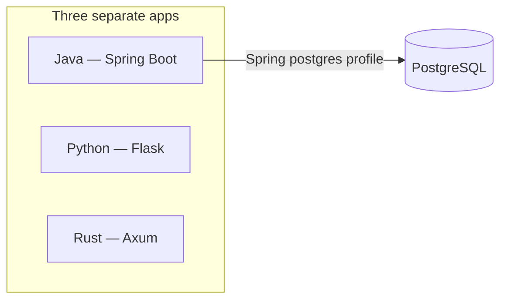
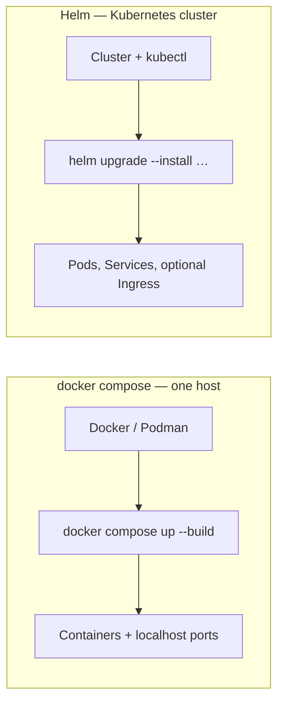

# exercises

Exercises (tiagoyamashita.com)

## Three application servers

This repo ships **three separate web apps**, each in its own stack:

| Stack | Role | Typical URL (local) |
|-------|------|---------------------|
| **Java** (`java/`) | Spring Boot | `http://localhost:8080/` |
| **Python** (`python/`) | Flask dashboard | `http://localhost:5000/` |
| **Rust** (`rust/`) | Axum dashboard | `http://localhost:8082/` |

**Rust on Windows:** If **`cargo`** fails with **`link.exe` not found**, the MSVC linker is missing — use **`podman compose up --build rust`** from this repo root, or fix the toolchain per [rust/README.md — Troubleshooting: Rust server won’t build or won’t open](rust/README.md#troubleshooting-rust-server-wont-build-or-wont-open).

Illustration (same stacks; Postgres is used when the Java app is wired to a real database):



They are independent exercises; you can build, run, and deploy **any subset**. **PostgreSQL** is used when you wire the Java app to a real database (for example via Compose or Kubernetes); see **`postgre/`** and [DOCKER.md](DOCKER.md).

_Diagrams use [Mermaid](https://mermaid.js.org/); they render on GitHub. In other viewers you may see the source block only._

## How to run or deploy them

**Normal / à la carte:** Run stacks locally the way each folder documents (toolchains, tests, dev servers), or build **container images** and run **one, two, or all three** with **Podman** or **Docker**. From the repo root:

```bash
podman compose up --build
```

If you use Docker Engine instead of Podman:

```bash
docker compose up --build
```

That starts **Postgres**, **Java**, **Python**, **Rust**, **reach-ui**, **Prometheus**, **Grafana**, and **ELK** (Elasticsearch, Logstash, Kibana) together. **Reach UI** (stack URL probes): `http://127.0.0.1:5174/`. To skip ELK only (save RAM):

```bash
podman compose up --build postgres java python rust reach-ui grafana prometheus
```

You can also bring up a subset of services. Images and ports are summarized in [DOCKER.md](DOCKER.md).

### Windows: `helm` or `docker` is not recognized

Usually the tools are installed but this **terminal session** still has an old **`PATH`**, or **Docker Desktop** was never installed.

1. **Close this terminal tab and open a new one** (or restart Cursor), then try again.
2. If it still fails, refresh **`PATH`** in the current session, then retry:

```powershell
$env:Path = [System.Environment]::GetEnvironmentVariable('Path','Machine') + ';' + [System.Environment]::GetEnvironmentVariable('Path','User')
```

3. **Helm:** install or repair with `winget install --id Helm.Helm -e --accept-source-agreements --accept-package-agreements` ([kubernetes-orchestration README](kubernetes-orchestration/README.md) has the same note).
4. **Docker:** install [Docker Desktop](https://docs.docker.com/desktop/install/windows-install/) **or** skip Docker and use **Podman** only (`podman compose …` as above). This machine already had **Podman** available when the environment `PATH` was refreshed; if `Get-Command podman` works, prefer **`podman compose`** until Docker is installed.
5. **Browser shows connection refused / timeout** while `podman compose ps` shows **Up** — see [DOCKER.md — Browser cannot reach containers](DOCKER.md#browser-cannot-reach-containers-podman-on-windows) (try **`http://127.0.0.1:`**… instead of **`localhost`**, start **`podman machine`**, check ports).

**Local testing vs production:** In practice, **`docker compose`** is for **running and testing on your own machine**—quick loops, integration checks, and the same container images you might build in CI. When you deploy to **production or shared environments**, you typically use **Helm** on **Kubernetes** (this repo’s chart under **`kubernetes-orchestration/`**) so you get replicas, rolling updates, cluster networking, and environment-specific values. **Terraform** is optional and addresses **infrastructure**, not the app chart itself: it often provisions **VPCs, managed clusters (EKS, AKS, …), IAM, and networking**. Many teams use Terraform (or similar) to **create** the cluster and supporting cloud resources, then **Helm** to **install this stack inside** that cluster—the two work **together**; Helm does not replace Terraform and Terraform does not deploy Helm charts unless you wire that explicitly (for example with a `helm_release` resource).

**Kubernetes with Helm:** To deploy **all three apps plus Postgres** on a **Kubernetes cluster**, use the **Helm** umbrella chart under **`kubernetes-orchestration/`**. Helm installs the chart as a **release** (Deployments, Services, PVCs, optional Ingress) and lets you tune replicas, image tags, and per-environment values. Details: [kubernetes-orchestration/README.md](kubernetes-orchestration/README.md).

**Regions and clouds (AWS, Azure, …):** Helm is the **installer for Kubernetes**—it does not pick a cloud or region by itself. You choose **which cluster** to deploy to (for example **Amazon EKS** in `us-east-1`, **Azure AKS** in `eastus`, **Google GKE**, or an on-prem cluster) by pointing **`kubectl`** / Helm at that cluster’s API. The **region** is primarily **where that cluster runs**; this repo’s Helm values can also record topology (for example `global.region` and selectors—see the orchestration README) so workloads line up with how you operate each environment. The **same chart** can target different regions or clouds using **different kubeconfig contexts** and **different values files** per cluster.

### Docker Compose vs Helm (Kubernetes)

Both can run the **same container images**, but they target different environments and operational models:



| | **`docker compose up`** | **Helm on Kubernetes** |
|---|-------------------------|-------------------------|
| **What it talks to** | Docker Engine or Podman on **one host** (your laptop, a VM, a single server). | A **Kubernetes cluster** (cloud managed Kubernetes, on-prem, minikube/kind for learning). |
| **Best for** | Local development, quick demos, integration testing on a single machine. | Shared environments, production-like setups: multiple machines, scheduling, rolling upgrades. |
| **How workloads run** | Compose starts **containers** with published ports (for example `localhost:8080`). | Kubernetes runs **Pods** (often managed by Deployments); traffic flows via **Services** and optionally **Ingress**, not only loopback. |
| **Scaling** | Typically **one** container per service unless you configure Compose scaling manually. | **Replica counts** per app (for example three Java Pods); the scheduler spreads them across nodes where configured. |
| **Images** | Often **built on the same machine** (`--build`) or pulled ad hoc. | The cluster usually **pulls from a container registry** you configure (tags and registry URL live in Helm values). See [DOCKER.md](DOCKER.md) and the orchestration README. |
| **Configuration** | Environment variables and Compose files on disk. | Helm **values** files (and Kubernetes Secrets/ConfigMaps generated by the chart) — easier to carry separate **dev/staging/prod** overrides. |
| **Requirements** | Docker or Podman installed. | A cluster, **`kubectl`**, **Helm**, and images your cluster can pull. |

Use **Compose** when you want the fastest loop on a single computer. Use **Helm** when you are deploying into **Kubernetes** and care about cluster primitives (replicas, namespaces, Ingress, node placement). You do not need Kubernetes for local hacking; you do not need Compose when your platform standard is Helm on a cluster.

---

**Rust** tooling bootstrap (rustup, cargo-nextest, `cargo build`) lives under **`rust/scripts/`**: [rust/README.md](rust/README.md) (“One-shot setup / reinstall”).

**PostgreSQL** for local development under **Podman**: [postgre/README.md](postgre/README.md).

**Grafana** (optional dashboards; Compose under **`grafana/`**): [grafana/README.md](grafana/README.md).

**ELK** (optional Elasticsearch + Logstash + Kibana; **Podman** or **Docker** Compose under **`elk/`**; cluster path uses Helm + **`kubectl`**): [elk/README.md](elk/README.md).

**Reach UI** (optional Vite page: probe Java / Python / Rust URLs with defaults and `localStorage`): [reach-ui/README.md](reach-ui/README.md).

On Windows, if **`link.exe` not found** and you do not want Visual Studio’s MSVC build tools, use the **GNU / MinGW** path: [rust/README.md — GNU target](rust/README.md#windows-gnu-target-mingw-instead-of-msvc) or run the project under **WSL**: [rust/README.md — WSL](rust/README.md#windows-wsl-linux-in-windows).
