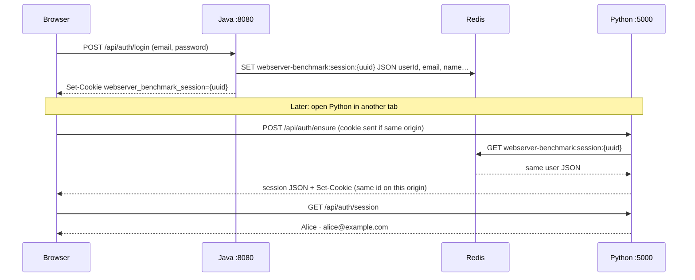

# Applications (`apps/`)

This folder holds the **WebServer BenchMark dashboards** and backing services. Each dashboard is a separate process and port, but they share **one Postgres database**, **one Redis instance**, and the **same session contract** — so a single login can be recognized everywhere once the browser carries the same session id.

## Dashboard apps (local Compose)

| App | Folder | URL (default) |
|-----|--------|----------------|
| Java | `java/` | http://127.0.0.1:8080/ |
| Python | `python/` | http://127.0.0.1:5000/ |
| Rust | `rust/` | http://127.0.0.1:8082/ |
| Zig | `zig/` | http://127.0.0.1:8083/ |
| React Node | `react-node/` | http://127.0.0.1:5174/ |

Shared infrastructure:

| Service | Folder | Role |
|---------|--------|------|
| Postgres | `postgres/` | Users, items, and other relational data |
| Redis | `redis/` | **Shared session store** (all apps read/write the same keys) |
| Kafka | `kafka/` | Optional messaging exercises |

Per-app details: see each folder’s `README.md`.

---

## Shared login: how one user appears on every app

The stack does **not** give each app its own user database or its own session silo. Login is **centralized in Redis**:

1. You sign in on any dashboard (`POST /api/auth/login`).
2. That app writes a **session record** to Redis at `webserver-benchmark:session:{sessionId}`.
3. The browser stores only the opaque **`sessionId`** in an HttpOnly cookie named `webserver_benchmark_session`.
4. Every other app, when it receives that same `sessionId`, loads the **same JSON** from Redis and shows the same `name`, `email`, and `userId`.



**Important idea:** the browser holds a **locker number** (`sessionId`). **Redis holds who you are.** Any app that gets the id and finds a valid key in Redis will show the same logged-in user.

### Session JSON (same shape in every language)

```json
{
  "sessionId": "78693595-4248-4e63-bfda-e08763560fd1",
  "userId": 42,
  "email": "alice@example.com",
  "name": "Alice",
  "issuedAt": "2026-06-16T12:00:00.000Z",
  "expiresAt": "2026-06-17T12:00:00.000Z",
  "issuer": "java"
}
```

| Field | Meaning |
|-------|---------|
| `userId` | `0` = guest; `> 0` = logged-in Postgres user |
| `issuer` | Last app that wrote the session (`java`, `python`, `rust`, `zig`, `react-node`) |
| `expiresAt` | Checked on every request; expired keys are deleted |

Inspect live keys in **RedisInsight**: http://127.0.0.1:5540/ — pattern `webserver-benchmark:session:*`.

---

## What happens when you open a dashboard

Every app follows the same bootstrap pattern (see `session-bootstrap.js` or equivalent in each UI):

1. **`POST /api/auth/ensure`** — If the browser already has a valid `webserver_benchmark_session` cookie, reuse that session from Redis; otherwise create a **guest** session (`userId: 0`).
2. **`GET /api/auth/session`** — Refresh the header / auth gate with the current user.
3. **Auth gate** — Dashboard content stays hidden until `userId > 0` and `email` are set (registered user, not guest).
4. **`POST /api/auth/login`** — Verify password against Postgres, write a new session to Redis, set the cookie.
5. **`POST /api/auth/logout`** — Delete the Redis key and clear the cookie; `ensure` creates a fresh guest session.

Auth API surface (identical on Java, Python, Rust, Zig, React Node):

| Method | Path | Purpose |
|--------|------|---------|
| `POST` | `/api/auth/ensure` | Resolve or create session; set cookie |
| `POST` | `/api/auth/login` | Bind session to Postgres user |
| `POST` | `/api/auth/logout` | Delete session |
| `POST` | `/api/auth/refresh` | New session id, same user |
| `GET` | `/api/auth/session` | Current session JSON |
| `POST` | `/api/users` | Register (public) |

Protected routes (`/htmx/*`, `/api/items*`, etc.) return **401** `{"error":"Sign in required"}` until the session is a logged-in user.

---

## Localhost and “automatic” login across ports

Default Compose publishes each app on a **different port**. Browsers treat that as a **different origin** (e.g. `http://127.0.0.1:8080` vs `http://127.0.0.1:5000`).

| Layer | Shared across ports? |
|-------|----------------------|
| **Redis** (`webserver-benchmark:session:{id}`) | **Yes** — one cluster, all apps on the Compose network |
| **Postgres** (`users` table) | **Yes** — same email/password on every app |
| **HttpOnly cookie** (`webserver_benchmark_session`) | **No** — each port has its own cookie jar |

So:

- **Server side:** any app can load **any** valid session id from Redis. That is what makes cross-app auth possible.
- **Browser side (default localhost):** a cookie set on `:8080` is **not** sent to `:5000`. Opening Python after logging in on Java starts as a **guest** on Python until you sign in there or **hand off the session id**.

### Hand off a session to another port (local dev)

After logging in on Java, copy the session id from the page footer or `GET /api/auth/session`, then on the other app:

```bash
curl -X POST http://127.0.0.1:5000/api/auth/ensure \
  -H "Content-Type: application/json" \
  -d '{"sessionId":"<uuid-from-java>"}' \
  -c cookies.txt -b cookies.txt
```

`ensure` validates the id in Redis and sets that app’s host-only cookie. The Python UI then shows the same user.

Or use **RedisInsight** to confirm the key exists, then sign in on the second app with the **same email/password** — you will see the same **user**, but Redis will hold a **separate** session id per app until you use a shared cookie domain.

### True “login once, all tabs recognize you”

That needs **one browser origin** for every dashboard, for example:

- Production: reverse proxy + `Domain=.yourdomain.com` on the cookie (see checklist in [`redis/SHARED-SESSION-PLAN.md`](redis/SHARED-SESSION-PLAN.md)).
- Local dev: a single host that path-routes to each app (e.g. `http://localhost:9000/java`, `http://localhost:9000/python`).

Then one `webserver_benchmark_session` cookie is sent to every path, every app reads the same Redis key, and opening a second app **automatically** loads the same user with no extra steps.

---

## Configuration (all apps)

| Variable | Default | Purpose |
|----------|---------|---------|
| `REDIS_URL` | `redis://redis:6379` | Redis connection in Compose |
| `REDIS_HOST` / `REDIS_PORT` | `redis` / `6379` | Fallback if URL unset |
| `WEBSERVER_BENCHMARK_SESSION_REDIS_PREFIX` | `webserver-benchmark:session:` | Key prefix |
| `WEBSERVER_BENCHMARK_SESSION_COOKIE` | `webserver_benchmark_session` | Cookie name |

Cookie set on login/ensure (all apps):

```
webserver_benchmark_session={sessionId}; HttpOnly; Path=/; Max-Age=86400; SameSite=Lax
```

Dashboard JavaScript uses `fetch(..., { credentials: "same-origin" })` only — it does **not** read the cookie or use `localStorage` for the session id.

---

## Where the code lives

| Concern | Locations |
|---------|-----------|
| Java | `java/.../auth/`, `static/js/session-bootstrap.js` |
| Python | `python/.../session_*.py`, `static/session-bootstrap.js` |
| Rust | `rust/src/auth/` |
| Zig | `zig/src/auth/` |
| React Node | `react-node/server/auth/`, `client/src/session.ts` |
| Deep dive (security, same-domain rollout, iframes) | [`redis/SHARED-SESSION-PLAN.md`](redis/SHARED-SESSION-PLAN.md) |

---

## Quick verification

1. Start the stack: `podman compose -f docker-compose.apps.yml up -d` (add `-f docker-compose.dev.yml` for hot reload).
2. Log in on Java (http://127.0.0.1:8080/).
3. In RedisInsight, open key `webserver-benchmark:session:{your-sessionId}` — note `userId` and `email`.
4. Open Rust (http://127.0.0.1:8082/) — guest until you log in or hand off the session id (see above).
5. After hand-off or same-origin setup, `GET /api/auth/session` on the second app should return the same `userId` and `email`.
