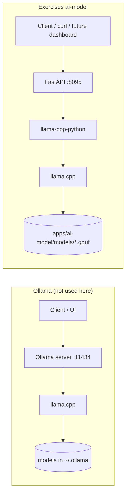
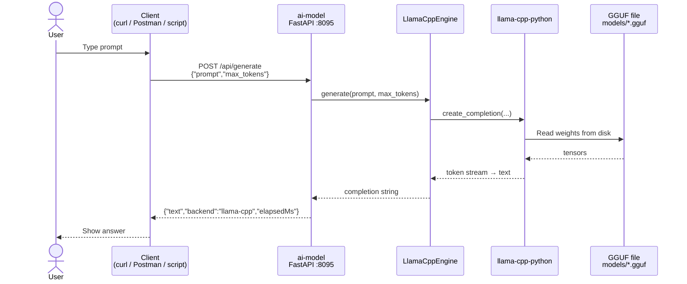
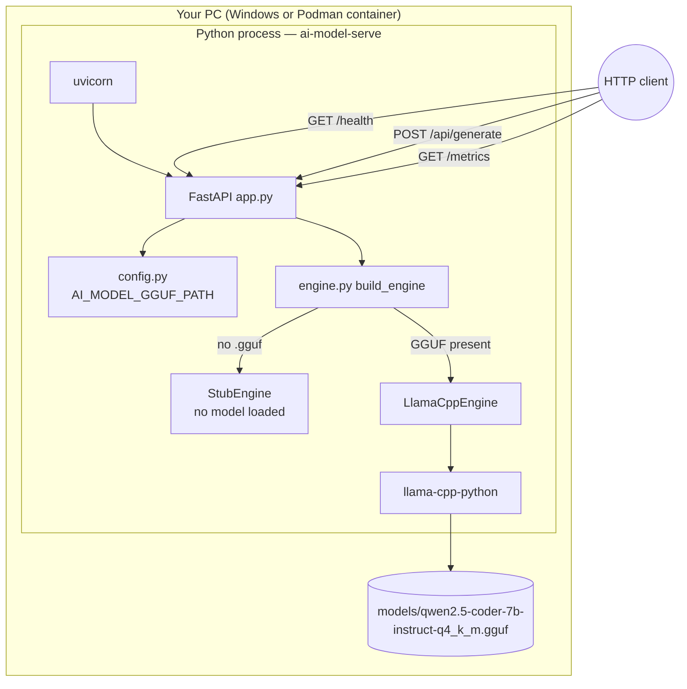
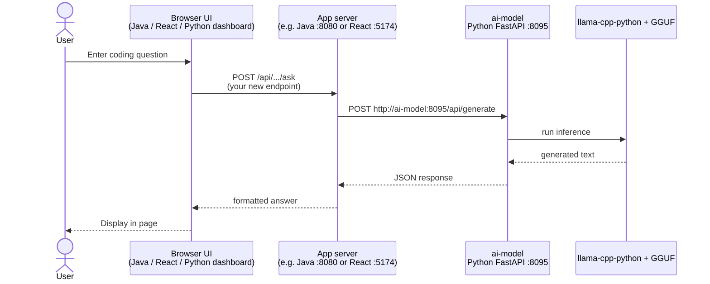
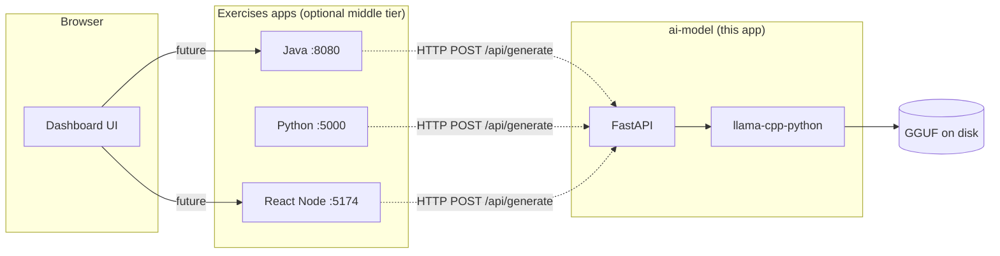
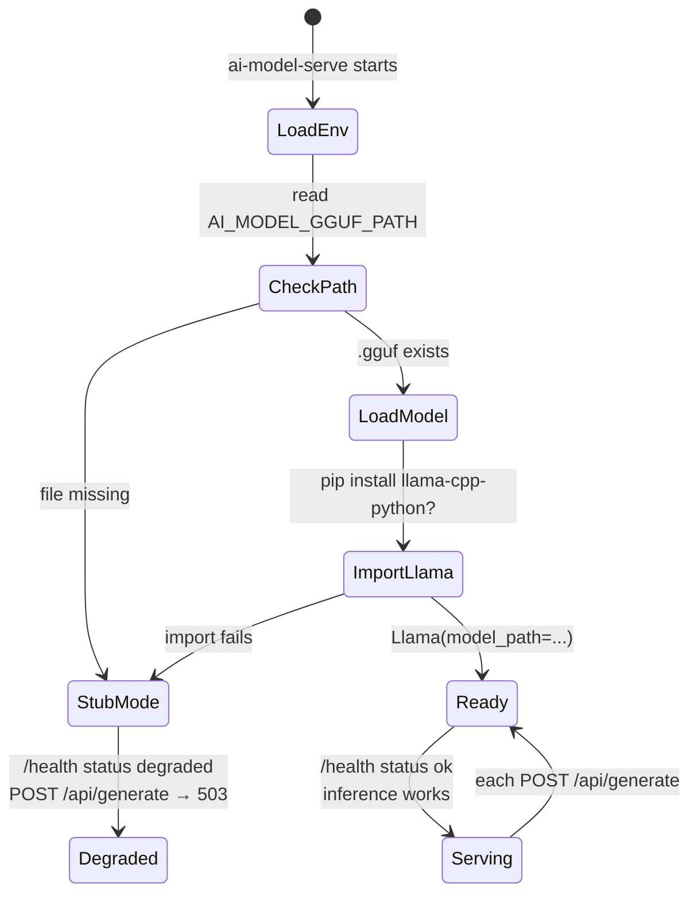
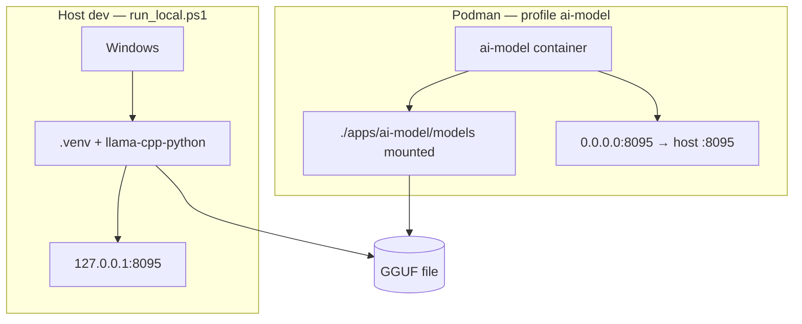

# AI Model — How it works

This app runs a **local GGUF model on your PC**. It does **not** use Ollama, OpenAI, or a separate inference daemon. Inference happens **inside the Python process** via **`llama-cpp-python`** (bindings for [llama.cpp](https://github.com/ggerganov/llama.cpp)).

## What runs the AI?

| Tool | Used here? | Role |
|------|------------|------|
| **llama-cpp-python** | **Yes** | Python library; loads `.gguf` and runs token generation in-process |
| **llama.cpp** | **Yes (under the hood)** | C++ engine that llama-cpp-python wraps |
| **Ollama** | No | Separate app with its own server, model pull UI, and REST API |
| **OpenAI / cloud API** | No | Remote hosted models |

**Ollama vs this app (same idea, different packaging):**



Both ultimately use **llama.cpp + GGUF**. Ollama is a standalone product; we embed inference in our own small FastAPI service.

---

## Current architecture (today)

There is **no dashboard UI wired yet**. You call the service directly (curl, Postman, or another app you add later).





---

## Typical future flow (UI → app server → ai-model)

When you hook this into the exercises stack, the pattern would look like this:





**Today:** dashed arrows are not implemented — call **ai-model directly** on port **8095**.

---

## Startup lifecycle



On first request after startup, the model is **already loaded in memory** (load happens at process start, not per request).

---

## HTTP API (what clients call)

| Method | Path | Purpose |
|--------|------|---------|
| `GET` | `/health` | Service + model ready state |
| `GET` | `/api/model/info` | Backend (`llama-cpp` or `stub`), GGUF path, GPU layers |
| `POST` | `/api/generate` | `{ "prompt": "...", "max_tokens": 128 }` → `{ "text", "backend", "elapsedMs" }` |
| `GET` | `/metrics` | Prometheus counters |

---

## Deploy modes



---

## File map (code path)

```
scripts/run_local.ps1          → starts ai-model-serve
src/ai_model/cli.py            → uvicorn entrypoint
src/ai_model/app.py            → FastAPI routes (/api/generate)
src/ai_model/engine.py         → LlamaCppEngine → llama_cpp.Llama
src/ai_model/config.py         → AI_MODEL_GGUF_PATH, N_GPU_LAYERS, …
models/*.gguf                  → weights (Qwen, SmolLM, etc.)
```

---

## Quick mental model

1. **Download** a `.gguf` file to `models/`.
2. **Start** `ai-model-serve` (Python + FastAPI on port 8095).
3. At startup, **llama-cpp-python loads the GGUF into RAM** (and optionally GPU).
4. **Clients send HTTP JSON** with a prompt; Python runs inference and returns text.
5. **No Ollama** — you own the whole stack: one process, one file, one API.
