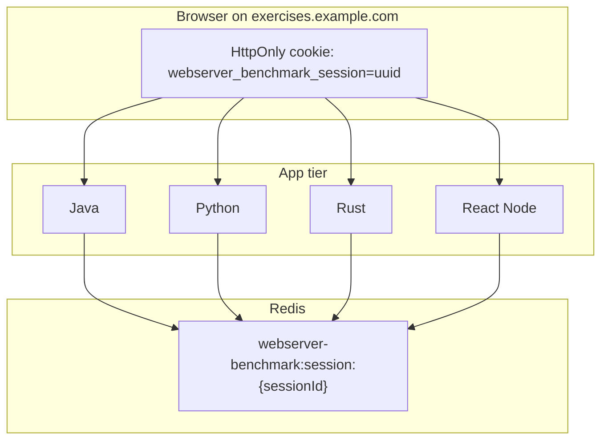
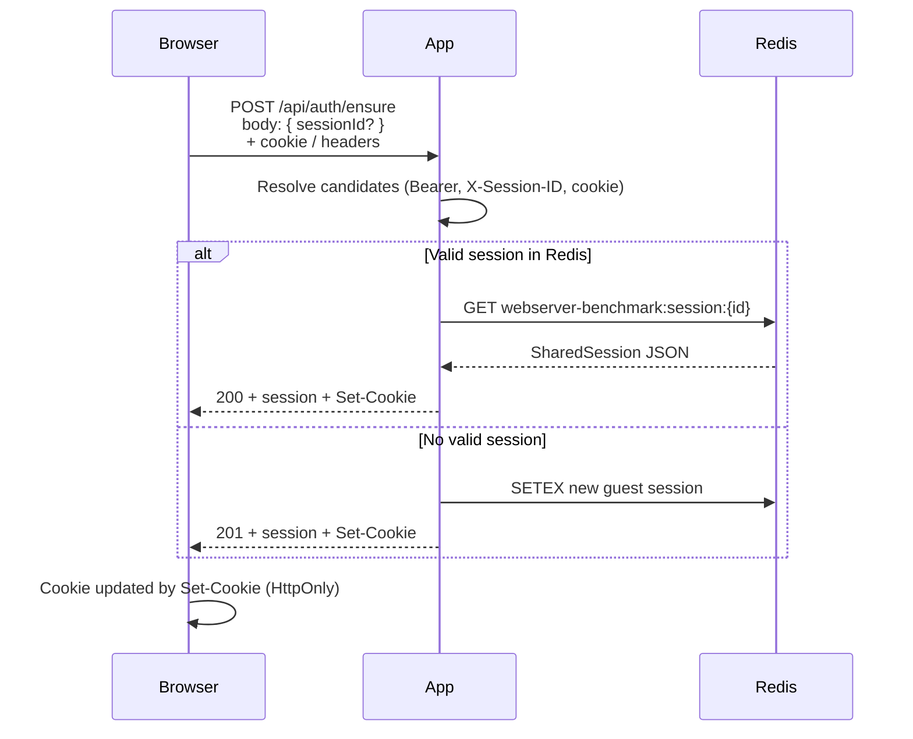

# Shared session plan (Redis + same domain)

How the exercises stack shares a **session id** across Java, Python, Rust, and React Node using **one Redis key space**, and how that relates to **browser cookies** on a **single parent domain**.

## Goal

A user who logs in on one app should be recognized on every other app without logging in again. All apps read and write the same session record in Redis; the browser carries a **session id** (not the full session JSON) and each app loads the payload from Redis on each request.

| Layer | Responsibility |
|-------|----------------|
| **Browser** | Sends `sessionId` via **HttpOnly cookie only** (`fetch` with `credentials: "same-origin"`) |
| **Any app** | Resolves `sessionId` → loads `SharedSession` from Redis |
| **Redis** | Single source of truth for session **state** (user, expiry, issuer) |
| **Postgres** | Source of truth for **users** at login time only |

## Local ports vs “same domain”

Today each app is published on its **own origin** (host + port):

| App | URL (Compose) |
|-----|----------------|
| Java | `http://127.0.0.1:8080` |
| Python | `http://127.0.0.1:5000` |
| Rust | `http://127.0.0.1:8082` |
| React Node | `http://127.0.0.1:5174` |

Browsers treat different ports as **different origins**. A cookie set by Java on `:8080` is **not** sent to Python on `:5000`.

**Same domain** (production-style) means one registrable domain with a reverse proxy, for example:

| App | Path or subdomain (example) |
|-----|----------------------------|
| Java | `https://exercises.example.com/java/` |
| Python | `https://exercises.example.com/python/` |
| Rust | `https://exercises.example.com/rust/` |
| React Node | `https://exercises.example.com/react/` |

Or subdomains: `java.exercises.example.com`, `python.exercises.example.com`, etc.

Under a shared parent domain, a cookie with `Domain=.exercises.example.com` can be sent to all subdomains (or to the apex if all apps share one host with path routing). That is the browser half of “same domain” sharing. The server half is unchanged: every app still reads the same Redis key.



## What is shared: session id + Redis payload

### Session id

- Opaque UUID string (e.g. `550e8400-e29b-41d4-a716-446655440000`).
- Created by whichever app runs `ensure` or `login`.
- **Browsers:** sent only via HttpOnly cookie (not readable by JS).
- **API clients / curl / stack relays:** may still use `Authorization: Bearer` or `X-Session-ID` headers.

### Redis record

- **Key:** `webserver-benchmark:session:{sessionId}` (prefix configurable).
- **Value:** JSON `SharedSession` (camelCase fields, same contract in all languages).
- **TTL:** 24 hours (`SETEX` / `setex`); apps also check `expiresAt` in the JSON.

```json
{
  "sessionId": "550e8400-e29b-41d4-a716-446655440000",
  "userId": 42,
  "email": "alice@example.com",
  "name": "Alice",
  "issuedAt": "2026-06-14T12:00:00Z",
  "expiresAt": "2026-06-15T12:00:00Z",
  "issuer": "java"
}
```

| Field | Meaning |
|-------|---------|
| `userId` | `0` = anonymous guest; `> 0` = logged-in Postgres user |
| `issuer` | App that last wrote the session (`java`, `python`, `rust`, `react-node`) |
| `expiresAt` | Authoritative expiry; delete key if past this time |

Inspect keys in **RedisInsight** (`http://127.0.0.1:5540/`) under pattern `webserver-benchmark:session:*`.

## How the browser carries the session id

**Dashboard clients (Java, Python, Rust, React Node):** session id is sent **only** via the HttpOnly `webserver_benchmark_session` cookie. All `fetch` calls use `credentials: "same-origin"`. Client JS does **not** read or write `localStorage`, and does **not** set `Authorization` or `X-Session-ID` (avoids XSS session theft).

Legacy `localStorage` key `webserver_benchmark_session_id` is cleared on load if present.

**Server-side resolution** still accepts three sources (for API clients, curl, stack tooling), in priority order:

1. `Authorization: Bearer {sessionId}`
2. `X-Session-ID: {sessionId}`
3. Cookie `webserver_benchmark_session={sessionId}`

Implementation references:

- Java: `SessionAuthFilter`, `static/js/session-bootstrap.js`
- Python: `session_auth.session_id_candidates`, `static/session-bootstrap.js`
- Rust: `auth/cookies.rs`, inline bootstrap in `templates/landing.html`
- React Node: `server/auth/cookies.ts`, `client/src/session.ts`

### Cookie (same-origin / same-domain)

Every app sets the same cookie shape on auth responses:

```
webserver_benchmark_session={sessionId}; HttpOnly; Path=/; Max-Age=86400; SameSite=Lax
```

| Attribute | Current value | Notes |
|-----------|---------------|-------|
| Name | `webserver_benchmark_session` | Override: `WEBSERVER_BENCHMARK_SESSION_COOKIE` |
| `HttpOnly` | yes | JS cannot read it (XSS mitigation) |
| `Path` | `/` | Sent for all paths on that origin |
| `SameSite` | `Lax` | Cross-site GET navigations still send cookie |
| `Domain` | *(not set)* | Host-only: only the exact host:port that set it |

**Same-domain plan:** when apps sit behind one parent domain, set `Domain=.exercises.example.com` (or equivalent) in all apps so one login cookie is visible to Java, Python, Rust, and React Node. Keep `Path=/` unless path-based routing requires a narrower path.

## Auth API (identical surface on each app)

All apps expose:

| Method | Path | Purpose |
|--------|------|---------|
| `POST` | `/api/auth/ensure` | Resolve existing session or create guest; sets cookie |
| `POST` | `/api/auth/login` | Bind session to Postgres user; sets cookie |
| `POST` | `/api/auth/logout` | Delete Redis key; clear cookie |
| `POST` | `/api/auth/refresh` | New session id, same user/guest payload |
| `GET` | `/api/auth/session` | Return current session JSON (+ `redisKey`) |

### Ensure flow (typical page load)



**Server-side bootstrap:** on `GET /` (HTML landing), Java, Python, and Rust can auto-create a guest session and set the cookie before the page renders, so the first visit already has a Redis row.

### Login flow

1. Client `POST /api/auth/login` with `{ "email": "..." }` or `{ "userId": 1 }`.
2. App loads user from **Postgres**, writes new `SharedSession` to Redis.
3. Response includes `Set-Cookie` and JSON with `sessionId` / `redisKey`.
4. Any other app authenticates the same user by reading that Redis key when the browser sends the same `sessionId`.

### Logout / refresh

- **Logout:** delete Redis key; clear cookie.
- **Refresh:** delete old key, write new UUID with same `userId` / guest fields; update cookie. Use after rotation or debugging stale ids.

## Server-to-server (no browser session)

Stack relays (Java → Python, etc.) call peer APIs with `X-Request-Origin: exercises-{java|python|rust}` instead of a user session. React Node’s `requireApiSession` skips session checks for those trusted origins so internal probes and relays keep working.

This is **not** end-user cross-app auth; it is service-to-service bypass. User-facing routes still require a Redis session when auth is enabled.

## Configuration

| Variable | Default | Purpose |
|----------|---------|---------|
| `REDIS_URL` | `redis://redis:6379` | Redis connection (Compose) |
| `REDIS_HOST` / `REDIS_PORT` | `redis` / `6379` | Host/port fallback |
| `WEBSERVER_BENCHMARK_SESSION_REDIS_PREFIX` | `webserver-benchmark:session:` | Key prefix |
| `WEBSERVER_BENCHMARK_SESSION_COOKIE` | `webserver_benchmark_session` | Cookie name |

Java additionally uses `app.session.*` in `application.yml` (same defaults).

If Redis is unavailable, auth endpoints return **503** and session middleware is disabled; apps still serve health and static pages where configured.

## Same-domain rollout checklist

Use this when moving from local multi-port dev to one domain behind nginx/Traefik/Caddy:

1. **Reverse proxy** — Route paths or subdomains to `java`, `python`, `rust`, `react-node` containers; terminate TLS at the edge.
2. **Cookie `Domain`** — Add `Domain=.your-domain.example` to cookie builders in all four apps (today omitted intentionally for host-only local cookies).
3. **Cookie `Secure`** — Set `Secure` on cookies when served over HTTPS.
4. **Keep Redis contract** — No change to key prefix or JSON shape; all apps already share Redis on the `exercises` network.
5. **CORS / SameSite** — With one site and `SameSite=Lax`, simple navigations share the cookie. If SPAs on subdomain A call APIs on subdomain B via `fetch`, evaluate `SameSite=None; Secure` or same-subdomain API routing.
6. **Verify in RedisInsight** — Log in on one app, open another, confirm the same `webserver-benchmark:session:{id}` key and matching `userId`.
7. **Logging** — Session id appears in request logs (`session_id` field) for correlation across apps in Kibana.

## Local dev: sharing a session across ports today

Because origins differ by port, use one of:

| Approach | How |
|----------|-----|
| **Manual copy** | Copy `sessionId` from `/api/auth/session` or RedisInsight; call another app with `curl -H "X-Session-ID: …"` |
| **Same id, new cookie** | `POST /api/auth/ensure` on app B with body `{ "sessionId": "<from A>" }` — validates Redis and sets B’s host-only cookie |
| **Redis only** | Confirm payload exists at `webserver-benchmark:session:{id}`; any app will accept the id via headers |

Full automatic cookie sharing across `:8080` and `:5000` **requires** either a shared parent domain + `Domain` attribute or a dev proxy that serves all apps under one host (e.g. `localhost:9000/java`, `localhost:9000/python`).

## Server-side sessions in Redis

The browser holds only a **session id** (locker number). **Redis holds the full record** (who you are, expiry, issuer). Every authenticated request does `GET webserver-benchmark:session:{sessionId}` — there is no self-contained token for the client to decode.

| Store | Role |
|-------|------|
| **Redis** | Fast, shared, TTL-backed session state; instant revoke via `DEL` |
| **Postgres** | Users at login time only (`userId`, email, name copied into session JSON) |
| **Browser** | Opaque id in HttpOnly cookie (not readable by JS) |

**Lifecycle:** create on `ensure` / login → resolve on each request → delete on logout → TTL expiry. Login always mints a **new** UUID; refresh deletes the old key and writes a new id with the same `userId`.

## Session lookup (not “most recent”)

Apps never scan Redis for “the latest session” or “sessions for this user.” They only look up **the exact id the client sent**:

1. Collect candidates: `Bearer` → `X-Session-ID` → cookie (first valid wins).
2. `GET webserver-benchmark:session:{thatId}`.
3. Read `userId` from the JSON at that key.

Multiple keys can exist (guest on `:8080`, guest on `:5000`, etc.) until TTL. Cross-app “same user” means **the same session id** in Redis (or separate logins per app). Logs correlate via `session_id`; tie users across apps with `userId > 0` after login on each session.

## Iframes and cookies

| Embed | Same origin as parent? | Gets parent’s `webserver_benchmark_session`? |
|-------|------------------------|--------------------------------------|
| Swagger/OpenAPI (`/swagger-ui` on same port) | Yes | Yes |
| Kafka UI embed (`:8091`), RedisInsight embed (`:5541`) | No (different port) | No |
| Java / Python / Rust / React Node each other | No in default Compose (separate ports) | No |

Iframe embedding alone does **not** share cookies across apps unless parent and iframe are **same origin** (or a shared `Domain` cookie). OpenAPI iframes work because they load from the same host:port as the dashboard. Java/Python/Rust are linked in new tabs, not iframed together.

## Security

### Session hijacking

Whoever holds the session id is treated as that user until expiry or logout. **Revocation strength** (delete Redis key) is the main advantage of server-side sessions over long-lived JWTs.

| Control | Today | Production target |
|---------|-------|-------------------|
| Random UUID v4 session ids | Yes | Keep |
| Server-side state in Redis | Yes | Keep; lock down Redis (private network, auth) |
| `HttpOnly` + `SameSite=Lax` cookie | Yes | Add `Secure` over HTTPS |
| Browser session via cookie only (no localStorage / Bearer from JS) | Yes | Keep |
| CSRF tokens on cookie-auth mutations | No | Add for `POST`/`PUT`/`DELETE` |
| Short TTL + rotate on login/refresh | 24h; refresh exists | Shorten TTL; invalidate old keys on login |
| Rate limit `/api/auth/*` | No | Add at gateway or in-app |

**Highest-impact hardening:** keep browser transport to **HttpOnly cookie only** + `fetch(..., { credentials: "include" })`. Focus on XSS prevention (CSP, sanitization) regardless of model.

### JWT vs Redis (this stack)

| | Redis server-side session | JWT (typical) |
|--|---------------------------|---------------|
| Instant logout / revoke | Strong (`DEL` key) | Weak unless blocklist / short TTL |
| Stolen credential | Id valid until revoke/TTL | Same; worse if long-lived + `localStorage` |
| Cross-app sharing | Natural (shared Redis) | All verifiers need same signing key |
| Signing key leak | N/A | Forge any token |

**Recommendation for this repo:** stay on **Redis sessions** for multi-app shared auth; add JWT later only for stateless public APIs or mobile clients (short access + rotated refresh in HttpOnly cookie). Picking JWT alone does not improve security if tokens live in `localStorage`.

### Brute force and enumeration

UUID v4 (~122 bits random) makes **online guessing infeasible**. Real risks are **theft** (XSS, HTTP without TLS, logs), **predictable ids** (never use sequential/timestamp ids), and **Redis exposed publicly**.

| Mitigation | Notes |
|------------|-------|
| Keep `UUID.randomUUID()` / `uuid.uuid4()` | Already used on create/login/refresh |
| Rate limit auth endpoints | Stops enumeration attempts even though guessing won’t succeed |
| Generic `401` for invalid/expired/missing session | Avoids leaking which ids exist |
| No session id in query strings | Prevents Referer leaks |
| Redis not on public internet | Prod: no open `6379` |

Session **fixation** is mitigated by minting a **new** UUID on login (already the behavior); `ensure` reuses an id only when it already exists and is valid in Redis.

### Security checklist (prod)

1. HttpOnly + `Secure` cookie only in the browser (no session id in JS).
2. HTTPS everywhere.
3. Rate limit `/api/auth/*`.
4. CSRF protection on mutating routes.
5. Shorter session TTL; rotate on login.
6. Redis on private network with password/ACL.
7. Unified 401 responses; redact session ids in logs where practical.

## Files to know

| Area | Location |
|------|----------|
| Java session model | `apps/java/.../auth/SharedSession.java`, `RedisSessionRepository.java`, `AuthService.java` |
| Java filters / API | `SessionAuthFilter.java`, `SessionPageBootstrapFilter.java`, `AuthController.java` |
| Python | `apps/python/.../session_models.py`, `session_repository.py`, `session_auth.py`, `auth_api.py` |
| Rust | `apps/rust/src/auth/session.rs`, `repository.rs`, `cookies.rs`, `handlers.rs` |
| React Node server | `apps/react-node/server/auth/` |
| React Node client | `apps/react-node/client/src/session.ts` |
| Browser bootstrap (Java) | `apps/java/src/main/resources/static/js/session-bootstrap.js` |
| Redis ops | `apps/redis/README.md` |

## Summary

- **Shared:** session **id** + **Redis JSON** at `webserver-benchmark:session:{sessionId}` — works today across all apps on the Compose network.
- **Per-origin today:** each port has its own HttpOnly cookie; not automatically shared between `:8080` and `:5000`.
- **Same domain:** add reverse proxy + `Domain` cookie (and `Secure` in prod) so one browser cookie carries the same id to every app; Redis lookup logic stays the same.
- **Security:** Redis server-side sessions; browser uses HttpOnly cookie only (no localStorage); UUID ids are not brute-forceable — protect against theft (HTTPS, XSS), rate-limit auth routes, lock down Redis in prod.
