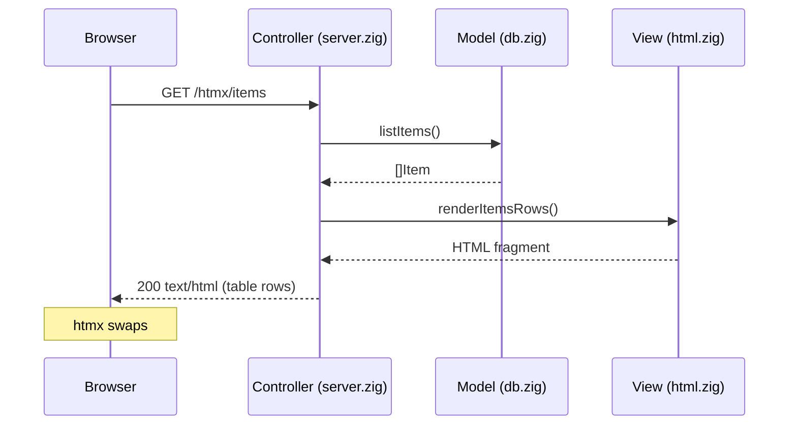

# Exercises — Zig

Zig stack dashboard with **htmx** UI, shared **Postgres `items`** CRUD, stack connectivity probes, and Prometheus metrics.

**Port:** http://127.0.0.1:8083/

This README has two guides:

1. [MVC + htmx in Zig](#mvc--htmx-in-zig) — how this app is structured
2. [Zig for web developers](#zig-for-web-developers) — language and patterns used here

---

## MVC + htmx in Zig

Zig has no Rails/Spring-style framework. MVC here means **clear file roles** and **thin HTTP handlers** that call into models and views. htmx replaces most client-side JavaScript: the server returns HTML fragments and the browser swaps them in.

### Request flow



### Directory layout

```
apps/zig/
  build.zig              # compile flags, link libpq
  build.zig.zon          # package manifest (Zig 0.13+)
  src/
    main.zig             # entry: allocator, config, DB connect, start server
    config.zig           # env vars → Config struct
    server.zig           # HTTP server + routing (controller)
    db.zig               # Postgres access (model)
    html.zig             # HTML fragments + form parsing (view helpers)
    stack_ping.zig       # service probes (extra model/service)
    metrics.zig          # Prometheus counters
    templates/
      dashboard.html     # full page shell (embedded at compile time)
  docker-entrypoint-dev.sh
  Dockerfile / Dockerfile.dev
```

| MVC role | File | Responsibility |
|----------|------|----------------|
| **Bootstrap** | `main.zig` | Wire allocator, load config, open DB, call `server.run` |
| **Controller** | `server.zig` | Accept TCP, parse HTTP, route by path/method, call model/view, write response |
| **Model** | `db.zig` | `Item` struct, `listItems`, `insertItem`, `getItem`, `deleteItem` via libpq |
| **View (shell)** | `src/templates/dashboard.html` | Page chrome, CSS, htmx attributes; embedded with `@embedFile` |
| **View (partials)** | `html.zig` | Row HTML, HTML escaping, URL/form decoding |
| **Config** | `config.zig` | Read `DB_*`, `APP_STACK_*`, `EXERCISES_WEB_*` from environment |

Keep **routing and HTTP status codes** in `server.zig`. Keep **SQL and domain types** in `db.zig`. Keep **string/HTML building** in `html.zig`.

### Controller pattern (`server.zig`)

1. **Listen** on a TCP port (`std.net`).
2. Per connection, create `std.http.Server` and loop while `state == .ready`.
3. **`receiveHead()`** (Zig 0.13) — read request line + headers.
4. **`handleRequest`** — match `request.head.method` + `request.head.target`.
5. Delegate to a named handler (`handleHtmxItems`, `handleApiCreateItem`, …).
6. **`request.respond(body, .{ .status = …, .extra_headers = … })`** — send response.

Handlers follow the same shape:

```zig
fn handleHtmxItems(app: *App, request: *std.http.Server.Request) !void {
    var database = app.db orelse {
        return try writeTextResponse(request, .service_unavailable, "text/html; charset=utf-8",
            "<tr><td colspan=\"3\">Postgres not configured.</td></tr>");
    };
    const items = database.listItems(app.allocator) catch { /* 500 partial */ };
    defer db_mod.Db.freeItems(items, app.allocator);
    const rows = try html_mod.renderItemsRows(app.allocator, items);
    defer app.allocator.free(rows);
    try writeTextResponse(request, .ok, "text/html; charset=utf-8", rows);
}
```

Use **`var database`** (not `const`) when unwrapping `app.db` — method calls need a mutable receiver.

### Model pattern (`db.zig`)

- Define a **struct** for rows (`Item`) and a **struct** for the connection (`Db`).
- Return a **typed error set** (`DbError`) instead of throwing strings.
- **Allocate** strings that outlive the query with the passed-in `std.mem.Allocator`; document who frees them (`freeItems`, `deinit`).
- Use **parameterized SQL** (`PQexecParams`) — never interpolate user input into SQL strings.

### View pattern: full page vs htmx partial

**Full page** — compile-time embed (must live under `src/` for Zig 0.13):

```zig
const dashboard_html = @embedFile("templates/dashboard.html");
// GET / → return dashboard_html
```

**htmx partial** — build HTML in Zig at runtime:

```zig
// html.zig
try list.writer().print(
    "<tr><td>{d}</td><td>{s}</td><td><code>{s}</code></td></tr>",
    .{ item.id, safe_name, safe_created },
);
```

Always **escape** user-controlled text (`escapeHtml`) before inserting into HTML.

### htmx conventions in this app

| Endpoint | Method | Returns | htmx usage |
|----------|--------|---------|------------|
| `/` | GET | Full dashboard HTML | Initial load |
| `/htmx/items` | GET | `<tr>…</tr>` rows | `hx-get`, `hx-target="#items-body"`, `hx-swap="innerHTML"` |
| `/htmx/items` | POST | Same rows after create | Form `hx-post` → swap table body |
| `/htmx/stack` | GET | Probe rows | `hx-trigger="load"` on tbody |

Example from `dashboard.html`:

```html
<tbody id="items-body"
       hx-get="/htmx/items"
       hx-trigger="load"
       hx-swap="innerHTML">
  <tr><td colspan="3" class="muted">Loading…</td></tr>
</tbody>
```

The server never returns JSON for htmx routes — only HTML fragments. JSON lives under `/api/*` for machines and the “JSON” link on the dashboard.

### REST alongside htmx

Same model, two response shapes:

| Concern | htmx route | REST route |
|---------|------------|------------|
| List items | `GET /htmx/items` → HTML rows | `GET /api/items` → JSON array |
| Create | `POST /htmx/items` (form `name=`) | `POST /api/items` (`{"name":"…"}`) |
| Get one | — | `GET /api/items/{id}` |
| Delete | — | `DELETE /api/items/{id}` |

### Adding a new feature (checklist)

1. **Model** — add function to `db.zig` (or a new `*_service.zig`).
2. **View** — add `render…` in `html.zig` if the UI needs a new partial.
3. **Controller** — add route branch in `handleRequest` + handler in `server.zig`.
4. **Template** — add htmx attributes in `dashboard.html` if the shell needs a new section.
5. **Rebuild** — `zig build` (or restart the dev container).

### Zig 0.13 HTTP notes

This app targets **Zig 0.13** (see `Dockerfile`). Newer Zig versions changed `std.http.Server` again. Here:

- Use `receiveHead()`, not `wait()`.
- Request fields are on `request.head` (`target`, `method`, `content_length`).
- Respond with `request.respond(content, .{ .status = .ok, .extra_headers = &headers })`.

---

## Zig for web developers

Short primer on Zig concepts as used in this project. Official docs: https://ziglang.org/learn/

### Build and run

```bash
cd apps/zig
zig build                    # output: zig-out/bin/exercises-zig
./zig-out/bin/exercises-zig
zig build test               # run tests in build.zig
```

`build.zig` declares the executable, include paths (libpq), and linked libraries. `build.zig.zon` names the package for Zig’s module system.

### Types and memory

| Concept | In this app |
|---------|-------------|
| `[]const u8` | Read-only string slice (HTTP path, env value, row name) |
| `[]u8` | Mutable buffer |
| `?T` | Optional (`app.db` may be null if `DB_HOST` unset) |
| `!T` | Value or error (`try`, `catch`) |
| `*T` / `*const T` | Pointer; methods on structs often take `*Self` |
| `std.mem.Allocator` | Heap allocation; pass through handlers, free what you allocate |

**Pattern:** anything allocated with `allocator.dupe`, `allocPrint`, or `ArrayList.toOwnedSlice` must be `defer allocator.free(…)` (or freed in `deinit`).

```zig
const rows = try html_mod.renderItemsRows(app.allocator, items);
defer app.allocator.free(rows);
```

### Errors, not exceptions

Functions return `DbError![]Item` or `!void`. Propagate with `try`; handle with `catch`:

```zig
const items = database.listItems(app.allocator) catch {
    return try writeTextResponse(request, .internal_server_error, ...);
};
```

Define narrow error sets on modules (`DbError`) instead of a single global error type.

### Structs and methods

```zig
pub const Db = struct {
    conn: ?*c.PGconn,

    pub fn listItems(self: *Db, allocator: std.mem.Allocator) DbError![]Item { ... }
    pub fn deinit(self: *Db) void { ... }
};
```

`pub` exports the symbol to other files in the package. Import with `@import("db.zig")`.

### Comptime embed

```zig
const dashboard_html = @embedFile("templates/dashboard.html");
```

The file is baked into the binary at compile time. Path must be **inside** `src/` (e.g. `src/templates/…`).

### C interop (libpq)

```zig
const c = @cImport({ @cInclude("libpq-fe.h"); });
```

`build.zig` adds `-I/usr/include/postgresql` and links `-lpq`. Use `&buf[0]` (not slice `.ptr`) when C APIs expect `*const u8`.

### Logging

```zig
std.log.info("connected to postgres at {s}", .{config.db_host.?});
std.log.err("request failed: {}", .{err});
```

Set log level at build/runtime via Zig’s log config; container logs go to stdout.

### Testing

Add tests in any file:

```zig
test "escapeHtml ampersand" {
    const a = std.testing.allocator;
    const out = try escapeHtml(a, "a & b");
    defer a.free(out);
    try std.testing.expectEqualStrings("a &amp; b", out);
}
```

Run with `zig build test`.

### Common pitfalls (we hit these building this app)

| Issue | Fix |
|-------|-----|
| `@embedFile("../outside/src")` | Keep assets under `src/` |
| `const x = app.db orelse …` then `x.listItems()` | Use `var database` so receiver is `*Db` |
| `slice.ptr` for C `*const u8` | Use `&slice[0]` |
| `std.http.Server.wait()` on 0.13 | Use `receiveHead()` + `request.head.*` |
| `uri.host.?.schemeless` on 0.13 | `Uri.Component` uses `.raw` / `.percent_encoded` |
| Windows CRLF in shell entrypoints | `sed -i 's/\r$//'` in Dockerfile; `.gitattributes` `eol=lf` |
| `.zig-cache` on Windows bind mount | Dev compose uses named Podman volumes for cache |

---

## Running the app

### Compose (recommended on Windows)

Prod image:

```bash
podman compose -f docker-compose.apps.yml up -d --build zig
```

Dev (rebuild on container start; caches in Podman volumes):

```bash
podman compose -f docker-compose.apps.yml -f docker-compose.dev.yml up -d --build zig
```

Reset corrupt zig cache:

```bash
podman volume rm exercises_zig-cache exercises_zig-global-cache exercises_zig-out
podman compose -f docker-compose.apps.yml -f docker-compose.dev.yml up -d --build zig
```

After `src/` changes in dev, restart the container to re-run `zig build`.

### Local build

Install Zig **0.13** from https://ziglang.org/download/ (matches the Docker image).

```bash
cd apps/zig
zig build
./zig-out/bin/exercises-zig
```

On Windows, linking libpq locally is awkward — prefer Podman unless you have Postgres dev libraries installed. Set `DB_HOST=127.0.0.1` when not using Compose.

#### WSL (`/mnt/c/...`)

Building on a Windows-mounted path (`/mnt/c/Users/...`) often fails with **`error: AccessDenied`** because Zig must **execute** helpers from `.zig-cache`, and `/mnt/c` does not support Unix execute permissions.

**Option A — redirect cache to the Linux filesystem (keep sources on `/mnt/c`):**

```bash
cd /mnt/c/Users/owner/Documents/Git/exercises/apps/zig
export ZIG_LOCAL_CACHE_DIR="$HOME/.cache/zig-exercises-local"
export ZIG_GLOBAL_CACHE_DIR="$HOME/.cache/zig"
mkdir -p "$ZIG_LOCAL_CACHE_DIR" "$ZIG_GLOBAL_CACHE_DIR"
zig build
```

**Option B — clone under `~` (fastest, recommended):**

```bash
git clone /mnt/c/Users/owner/Documents/Git/exercises ~/exercises
cd ~/exercises/apps/zig
sudo apt install -y libpq-dev
zig build
```

Also install **Zig 0.13** and `libpq-dev` in WSL (`sudo apt install libpq-dev`).

---

## Endpoints

| Area | Routes |
|------|--------|
| Dashboard | `GET /` |
| htmx | `GET/POST /htmx/items`, `GET /htmx/stack` |
| REST | `GET/POST /api/items`, `GET/DELETE /api/items/{id}` |
| Ops | `GET /health`, `GET /metrics` |

---

## Environment

Postgres (same as Java/Python/Rust): `DB_HOST`, `DB_PORT`, `DB_NAME`, `DB_USERNAME`, `DB_PASSWORD`.

Stack probes: `APP_STACK_JAVA_BASE_URL`, `APP_STACK_PYTHON_BASE_URL`, `APP_STACK_RUST_BASE_URL`, `APP_STACK_REACT_NODE_BASE_URL`, `APP_STACK_PROMETHEUS_BASE_URL`, `APP_STACK_GRAFANA_BASE_URL`.

Web: `EXERCISES_WEB_HOST`, `EXERCISES_WEB_PORT` (default `8083`).
