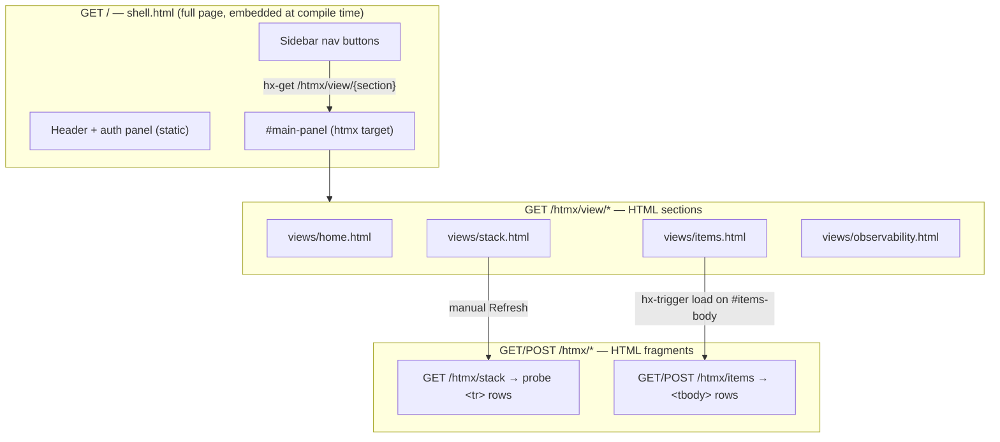
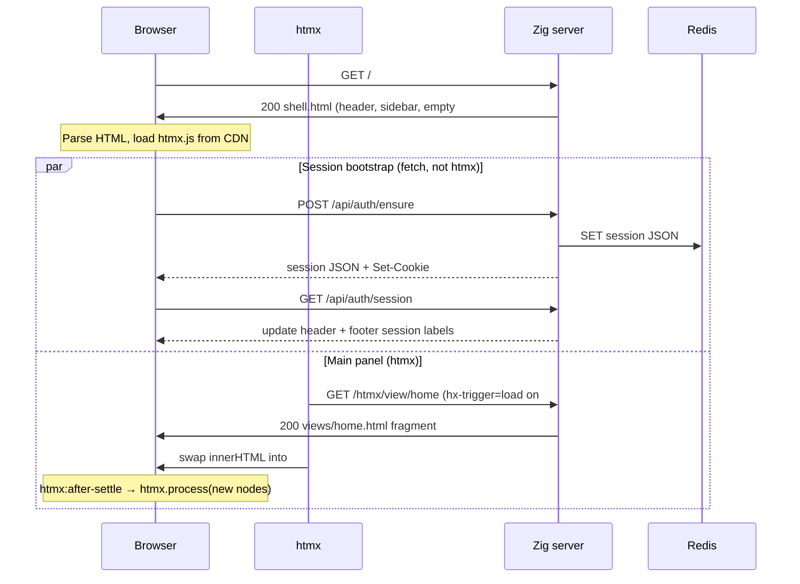
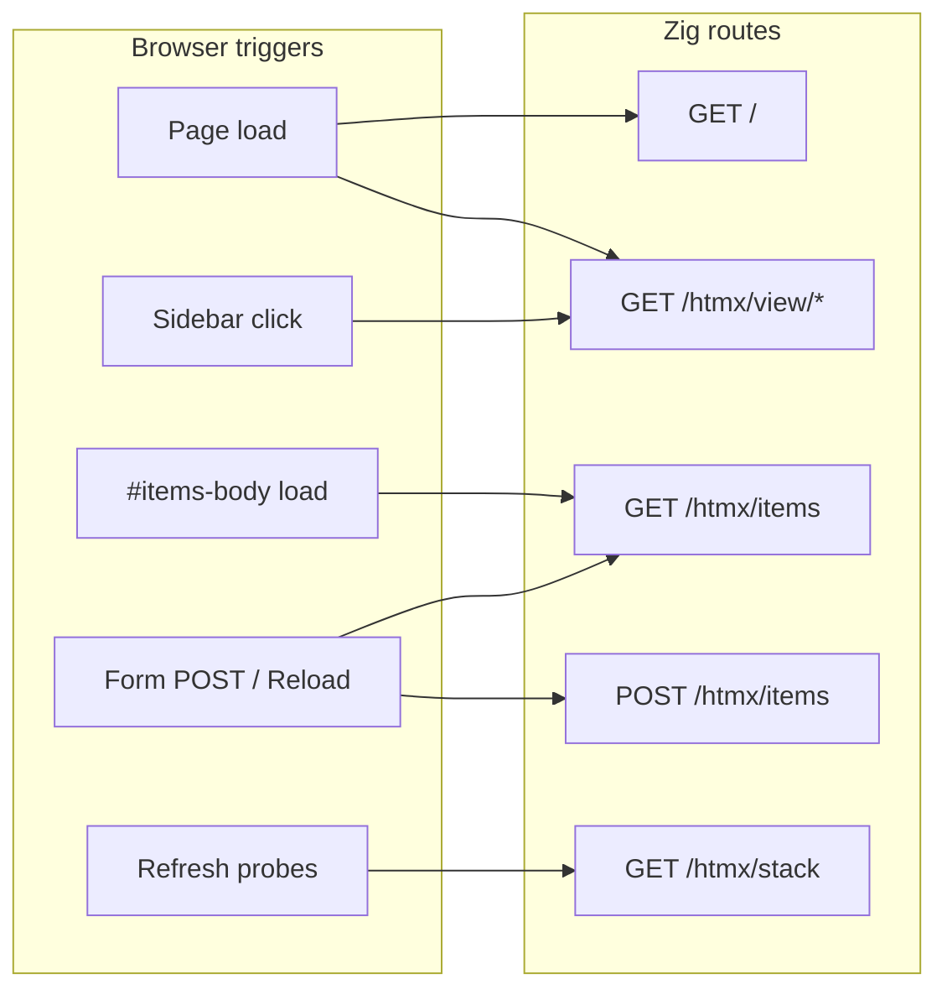
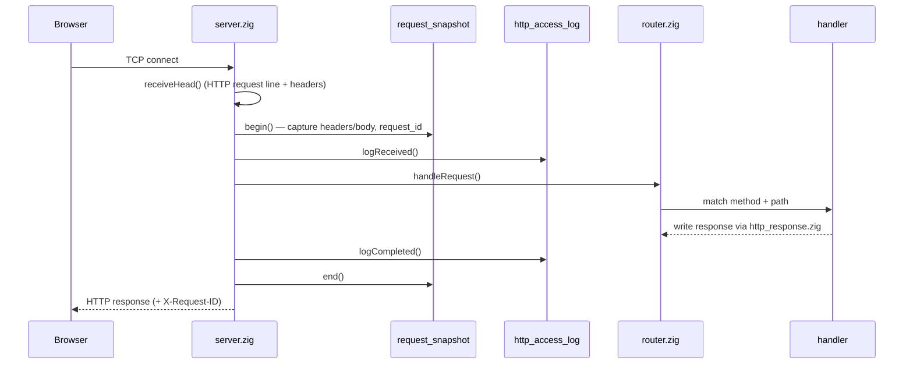
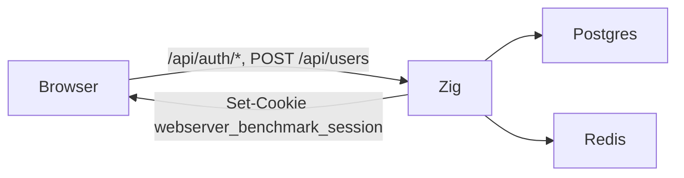

# WebServer BenchMark — Zig

Zig stack dashboard with **htmx** UI, shared **Postgres `items`** CRUD, stack connectivity probes, Prometheus metrics, and **native Redis session auth** (shared with Java/Rust).

**Port:** http://127.0.0.1:8083/

This document explains four cross-cutting concerns:

1. [htmx page loading](#htmx-page-loading) — how the dashboard shell and sections load without full page reloads
2. [How a request is resolved](#how-a-request-is-resolved)
3. [How logs are created and filtered](#how-logs-are-created-and-filtered)
4. [How users are authenticated](#how-users-are-authenticated)

See also [Running the app](#running-the-app) and [Endpoints](#endpoints).

---

## htmx page loading

The UI is a **persistent shell** (`shell.html`) with a sidebar and a `#main-panel` content area. htmx swaps HTML fragments from the server; there is no client-side router and almost no custom JavaScript for navigation.

### Page structure (component view)



| Layer | Route pattern | Returns | Swapped into |
|-------|---------------|---------|--------------|
| **Shell** | `GET /` | Full HTML document | browser (initial navigation) |
| **View** | `GET /htmx/view/{home,stack,items,observability}` | `<section>…</section>` | `#main-panel` (`innerHTML`) |
| **Data** | `GET /htmx/stack` | `<tr>…</tr>` rows | `#stack-body` (`innerHTML`) |
| **Data** | `GET/POST /htmx/items` | `<tbody id="items-body">…</tbody>` | `#items-body` (`outerHTML`) |

View templates are embedded in `templates.zig` (`@embedFile`). Data partials are built at runtime in `html.zig` (items rows) or `stack_ping.zig` (probe rows).

### 1 — Initial page load



On first load, `#main-panel` has `hx-get="/htmx/view/home"` and `hx-trigger="load"`, so the Home section appears automatically after the shell arrives.

### 2 — Sidebar navigation (view swap)

Each sidebar button requests a **view partial** and replaces the entire main panel:

```html
hx-get="/htmx/view/items"
hx-target="#main-panel"
hx-swap="innerHTML"
```

```mermaid
sequenceDiagram
    participant User
    participant htmx
    participant Zig as Zig server

    User->>htmx: Click "Items (Postgres)"
    htmx->>Zig: GET /htmx/view/items
    Zig->>htmx: 200 views/items.html (&lt;section&gt; + form + table skeleton)
    htmx->>User: Replace #main-panel innerHTML
    Note over htmx: after-settle → htmx.process(#main-panel)

    Note over htmx,User: New #items-body has hx-trigger=load
    htmx->>Zig: GET /htmx/items (automatic)
    Zig->>htmx: 200 &lt;tbody id="items-body"&gt;… rows …&lt;/tbody&gt;
    htmx->>User: outerHTML swap on #items-body
```

The sidebar `hx-on:htmx:after-request` handler sets `aria-current="page"` on the active button.

**Stack** and **Observability** views load the section only — stack probes run when the user clicks **Refresh probes**; observability links open `/health` and `/metrics` in new tabs.

### 3 — Items: nested htmx (view + data)

The Items view uses **two htmx levels**:

```mermaid
sequenceDiagram
    participant User
    participant htmx
    participant Zig as Zig server
    participant PG as Postgres

    Note over User,PG: Already on Items view (#items-body visible)

    User->>htmx: Submit create form (hx-post="/htmx/items")
    htmx->>Zig: POST /htmx/items (body: name=…)
    Zig->>PG: INSERT item
    PG-->>Zig: new row
    Zig->>Zig: html.renderItemsRows + status row
    Zig->>htmx: 200 &lt;tbody id="items-body"&gt;…&lt;/tbody&gt;
    htmx->>User: outerHTML swap #items-body
    Note over User: Form reset if status row shows .ok

    User->>htmx: Click Reload
    htmx->>Zig: GET /htmx/items
    Zig->>PG: SELECT items
    Zig->>htmx: 200 fresh &lt;tbody&gt;
    htmx->>User: outerHTML swap #items-body
```

Create and reload both return the **same shape** (`<tbody id="items-body">`) so `hx-swap="outerHTML"` keeps the element id stable for the next request.

### 4 — htmx route map



### Why `htmx.process` on `#main-panel`

View HTML injected into `#main-panel` contains **new** `hx-*` attributes (e.g. `#items-body` with `hx-trigger="load"`). The shell listens for:

```html
hx-on::after-settle="htmx.process(event.detail.elt)"
```

That registers htmx behaviour on freshly swapped nodes so nested triggers (items table load, stack refresh, form POST) work without a full page reload.

---

## How a request is resolved

Zig has no web framework. Each TCP connection is handled in a thread; routing is explicit `method + path` matching in `router.zig`, with handlers in `src/handlers/`.

### High-level flow



### Server loop (`server.zig`)

1. **`main.zig`** loads config, optionally connects Postgres, calls `server.run`.
2. **`run`** listens on `WEBSERVER_BENCHMARK_WEB_HOST` / `WEBSERVER_BENCHMARK_WEB_PORT` (default `0.0.0.0:8083`).
3. Each accepted connection spawns a **detached thread** (`handleConnectionThread`).
4. Inside the connection loop:
   - `http_server.receiveHead()` reads one request (Zig 0.13 API).
   - `request_snapshot.begin()` builds observability context (see [Logging](#how-logs-are-created-and-filtered)).
   - `http_access_log.logReceived()` may emit an inbound access line.
   - `router.handleRequest()` dispatches to a handler.
   - On handler error: log + `500 internal server error`.
   - `http_access_log.logCompleted()` emits completion line with status and duration.
   - `request_snapshot.end()` frees snapshot memory.

Prometheus counter: every received head increments `metrics.incRequests()` via `router.recordRequest()`.

### Router (`router.zig`)

The router strips the query string with `http.targetOnly()` then matches **exact path + method** in order:

| Match | Handler |
|-------|---------|
| `GET /health` | `health.handleHealth` |
| `GET /metrics` | `health.handleMetrics` |
| `GET /` | `home.handleShell` — full dashboard HTML |
| `POST /api/users` | `users.handleCreateUser` |
| `POST /api/auth/*`, `GET /api/auth/session` | `auth.*` |
| `GET /htmx/view/*` | view partials (home, stack, items, observability) |
| `GET/POST /htmx/items`, `GET /htmx/stack` | items / stack htmx |
| `GET/POST /api/items`, `GET/DELETE /api/items/{id}` | REST items API |
| no match | `404 not found` |

Dynamic REST paths parse the numeric suffix: `/api/items/42` → `item_id = 42`.

Handlers live in `src/handlers/` (`home.zig`, `items.zig`, `api_items.zig`, `stack.zig`, `auth.zig`, `users.zig`, …). They call into `db.zig`, `redis_client.zig`, `auth/service.zig`, `stack_ping.zig`, or `outbound_http.zig` and write responses through `http_response.zig`.

### Response writing (`http_response.zig`)

All handlers should use helpers here so the request snapshot records status and (for JSON) response body:

- `writeTextResponse` — HTML/plain
- `writeJsonResponse` / `writeJsonResponseExtra` — JSON (+ optional extra headers, e.g. `Set-Cookie`)
- `writeNoContentResponse` — 204

Each successful write calls `request_snapshot.recordResponse()` and adds **`X-Request-ID`** to the response when a snapshot is active.

### Request body reuse

For `POST`/`PUT`/`PATCH`, `request_snapshot.begin()` may read up to **64 KiB** of body into the snapshot for logging. Handlers then use `http.readBody()`, which returns the **pre-read copy** via `request_snapshot.preReadBody()` when available — so the body is not consumed twice.

---

## How logs are created and filtered

Logging has three layers: **stdout** (`std.log`), **structured JSON file** (ELK/Filebeat), and **Prometheus** (request counter only).

Enable JSON file logging with:

```bash
WEBSERVER_BENCHMARK_OBSERVABILITY=1
LOG_PATH=/app/logs   # writes LOG_PATH/demo-app.json.log
```

### Layer 1 — HTTP access logs (`http_access_log.zig`)

One **received** and one **completed** line per inbound HTTP request (when not filtered).

| Field | Source |
|-------|--------|
| `logger` | `"http.request"` |
| `phase` | `"received"` or `"completed"` |
| `method`, `path` | request line |
| `status`, `ms` | completed only |
| `request_id` | from snapshot |
| `headers`, `url_params`, `body` | received only (filtered — see below) |
| `body` (response) | completed only, JSON responses capped at 4 KiB |

**Filtering — quiet paths** (`shouldLogHttpAccess`):

- `GET /metrics` is **suppressed** unless the response status is **not 200** (avoids Prometheus scrape noise).
- All other routes log normally.

### Layer 2 — Request snapshot (`request_snapshot.zig`)

Built at the start of each request; drives access logs and enriches controller logs.

**Header allow-list** (only these are logged):

`x-request-id`, `x-request-origin`, `x-dashboard-page`, `x-session-id`, `content-type`, `accept`, `user-agent`, `host`

**Body capture:**

- Methods: `POST`, `PUT`, `PATCH` only
- Max size: **65 536 bytes**
- Parsed to JSON: raw JSON objects pass through; `application/x-www-form-urlencoded` becomes key/value JSON; other text becomes `{"_raw":"…"}`

**Request ID** (`request_id.zig`):

- Reuse inbound `X-Request-ID` if it matches `^[a-zA-Z0-9._-]{8,64}$` or is a UUID
- Otherwise generate `{nano}-{seq}`

The active snapshot is stored in **`threadlocal var active`** and copied into `request_context` for outbound calls on the same thread.

### Layer 3 — Controller logs (`controller_logging.zig`)

Handlers call named helpers:

```zig
ctrl_log.logReceived("handleApiListItems", SOURCE, "GET", "/api/items");
ctrl_log.logSucceeded("handleApiListItems", SOURCE, "item_count={d}", .{items.len});
ctrl_log.logWarn(...);
ctrl_log.logError(...);
```

Each call:

1. Writes a human line to **stdout** via `std.log`.
2. Writes a JSON line to **`demo-app.json.log`** via `observability_log.zig` with:
   - `controller` = handler name
   - `source` = file path constant (e.g. `src/handlers/api_items.zig`)
   - merged snapshot fields: `request_id`, `method`, `path`, `headers`, `url_params`, `body` (on receive)
   - response `body` JSON fragment on success (when recorded)

### Layer 4 — Outbound HTTP logs (`outbound_http_log.zig`)

Stack probes use `outbound_http.fetch()`, which logs:

| Phase | Logger | When |
|-------|--------|------|
| `outbound_request` | `http.client` | before fetch |
| `outbound_response` | `http.client` | after fetch (INFO if 2xx, WARN otherwise) |
| `outbound_failed` | `http.client` | network/parse failure |

Includes `relay_target`, `relay_origin` (`webserver-benchmark-zig`), `request_id`, and **`origin_method` / `origin_path`** linking back to the inbound request.

Response bodies for outbound calls are capped at **4096 bytes** for logging.

### Layer 5 — Postgres query logs (`postgres_log.zig`)

`db.zig` calls `postgres_log.logQuery` / `logQueryFailed` around SQL. Lines include:

- `target_service=postgres`, host/port/dbname
- `request_id` and `application_name` (`webserver-benchmark-zig;req={id}`) for correlation in Postgres logs

### JSON line format (`observability_log.zig`)

All structured lines share:

```json
{
  "timestamp": "2026-06-16T04:50:49.221Z",
  "level": "INFO",
  "service": "webserver-benchmark-zig",
  "controller": "handleApiListItems",
  "source": "src/handlers/api_items.zig",
  "message": "handleApiListItems succeeded item_count=3",
  "log_seq": 42,
  "request_id": "…",
  "method": "GET",
  "path": "/api/items"
}
```

HTTP access lines use `"logger": "http.request"` instead of `controller`/`source`.

If `WEBSERVER_BENCHMARK_OBSERVABILITY` is unset, JSON file logging is disabled; stdout logging still works.

---

## How users are authenticated

Zig implements **native Redis session auth** compatible with Java and Rust. Sessions are stored at `webserver-benchmark:session:{sessionId}` in Redis as JSON; the browser holds an **`webserver_benchmark_session` HttpOnly cookie**. User registration and login verify passwords against Postgres via vendored **bcrypt** (same `$2b$` hashes as the other stacks).

### Architecture



Redis connection: `REDIS_URL` or `REDIS_HOST` + `REDIS_PORT` (Compose default `redis://redis:6379`).

### Auth routes (`handlers/auth.zig`, `handlers/users.zig`)

| Zig route | Handler | Cookie behaviour |
|-----------|---------|------------------|
| `POST /api/users` | `users.handleCreateUser` | none (registration) |
| `POST /api/auth/ensure` | `auth.handleEnsure` | **Set** cookie on success |
| `POST /api/auth/login` | `auth.handleLogin` | **Set** cookie on success |
| `POST /api/auth/logout` | `auth.handleLogout` | **Delete** Redis key for cookie session id; **Set** cookie to new guest session |
| `POST /api/auth/refresh` | `auth.handleRefresh` | **Set** cookie on success |
| `GET /api/auth/session` | `auth.handleSession` | reads existing cookie |

Session JSON matches the shared format: `sessionId`, `userId`, `email`, `name`, `issuedAt`, `expiresAt`, `issuer` (`zig`), plus `redisKey` in API responses.

Core modules:

- `redis_client.zig` — minimal RESP client (`PING`, `GET`, `SET EX`, `DEL`)
- `auth/session.zig` — session config, JSON serialize/parse, TTL (24h default)
- `auth/repository.zig` — Redis read/write/delete
- `auth/service.zig` — ensure, login, logout, refresh, resolve
- `auth/cookies.zig` — cookie parse + `Set-Cookie` helpers
- `auth/password.zig` — bcrypt hash/verify via `vendor/bcrypt/`

If Redis is not configured, auth endpoints return **503**. Login and registration also require Postgres.

### Browser session (`templates/shell.html`)

On page load, inline JavaScript:

1. Calls `POST /api/auth/ensure` (creates guest session if needed).
2. Calls `GET /api/auth/session` to refresh UI.
3. Header login form → `POST /api/auth/login`.
4. Logout button → `POST /api/auth/logout` → new guest session via ensure.

**Logged-in check (client-side):** `userId > 0` and `email` present on session JSON.

Session metadata (session id, Redis key) is shown in the page footer.

### What Zig enforces

Server-side **`auth/guard.zig`** blocks `/htmx/*` and `/api/items*` with **401** `{"error":"Sign in required"}` until the session has `userId > 0` and an email (registered user, not guest). Public routes: `GET /`, `/health`, `/metrics`, `/api/auth/*`, and `POST /api/users`.

The shell shows a full-page **auth gate** (sign in / create account) until logged in; `#app-shell` (sidebar + htmx panel) stays hidden until then.

---

## Source layout (request / log / auth)

```
src/
  main.zig                 # bootstrap, observability_log.init
  server.zig               # TCP accept, snapshot wrap, call router
  router.zig               # method + path dispatch
  http_response.zig        # respond + recordResponse + X-Request-ID
  request_snapshot.zig     # inbound capture, header allow-list, body limits
  request_id.zig           # generate / validate request IDs
  request_context.zig      # thread-local origin + request_id for outbound
  http_access_log.zig      # inbound access lines + quiet GET filter
  controller_logging.zig   # handler INFO/WARN/ERROR → JSON file
  observability_log.zig    # JSON line writer (demo-app.json.log)
  redis_client.zig         # RESP client for session storage
  auth/
    session.zig            # SharedSession JSON + config
    repository.zig         # Redis CRUD
    service.zig            # ensure / login / logout / refresh
    cookies.zig            # Cookie header helpers
    password.zig           # bcrypt via vendor/bcrypt
    guard.zig              # require logged-in user for protected routes
  outbound_http.zig        # HTTP client for stack probes
  outbound_http_log.zig    # outbound request/response/failure lines
  postgres_log.zig         # SQL correlation fields
  handlers/
    auth.zig               # /api/auth/* + Set-Cookie
    users.zig              # POST /api/users registration
    api_items.zig          # example controller logging
    home.zig, items.zig, stack.zig, …
  templates/
    shell.html             # dashboard shell + client session JS
```

---

## Running the app

### Compose (recommended on Windows)

```bash
podman compose -f docker-compose.apps.yml up -d --build zig
```

Dev overlay (rebuild on container start):

```bash
podman compose -f docker-compose.apps.yml -f docker-compose.dev.yml up -d --build zig
```

Zig depends on **Redis** for sessions and **Postgres** for items/users. Stack probes still use `APP_STACK_*` URLs (including Rust). Set observability env in Compose: `WEBSERVER_BENCHMARK_OBSERVABILITY=1`, `LOG_PATH=/app/logs`.

### Local build

Requires **Zig 0.13** and `libpq`. On Windows, prefer Podman (see existing WSL notes in git history).

```bash
cd apps/zig
zig build
./zig-out/bin/webserver-benchmark-zig
```

---

## Endpoints

| Area | Routes |
|------|--------|
| Dashboard | `GET /` |
| htmx views | `GET /htmx/view/{home,stack,items,observability}` |
| htmx data | `GET/POST /htmx/items`, `GET /htmx/stack` |
| REST items | `GET/POST /api/items`, `GET/DELETE /api/items/{id}` |
| Auth (native Redis) | `POST /api/users`, `POST /api/auth/{ensure,login,logout,refresh}`, `GET /api/auth/session` |
| Ops | `GET /health`, `GET /metrics` |

---

## Environment

| Variable | Purpose |
|----------|---------|
| `WEBSERVER_BENCHMARK_WEB_HOST`, `WEBSERVER_BENCHMARK_WEB_PORT` | Listen address (default `0.0.0.0:8083`) |
| `DB_*` | Postgres for `/api/items`, htmx items, and user registration |
| `REDIS_HOST`, `REDIS_PORT`, `REDIS_URL` | Redis session store (Compose: `redis://redis:6379`) |
| `WEBSERVER_BENCHMARK_SESSION_REDIS_PREFIX` | Session key prefix (default `webserver-benchmark:session:`) |
| `WEBSERVER_BENCHMARK_SESSION_COOKIE` | Cookie name (default `webserver_benchmark_session`) |
| `APP_STACK_*_BASE_URL` | Stack probe targets (Java, Python, Rust, …) |
| `APP_STACK_*_BASE_URL` | Stack probe targets |
| `WEBSERVER_BENCHMARK_OBSERVABILITY` | `1` / `true` / `yes` enables JSON file logging |
| `LOG_PATH` | Directory for `demo-app.json.log` |
